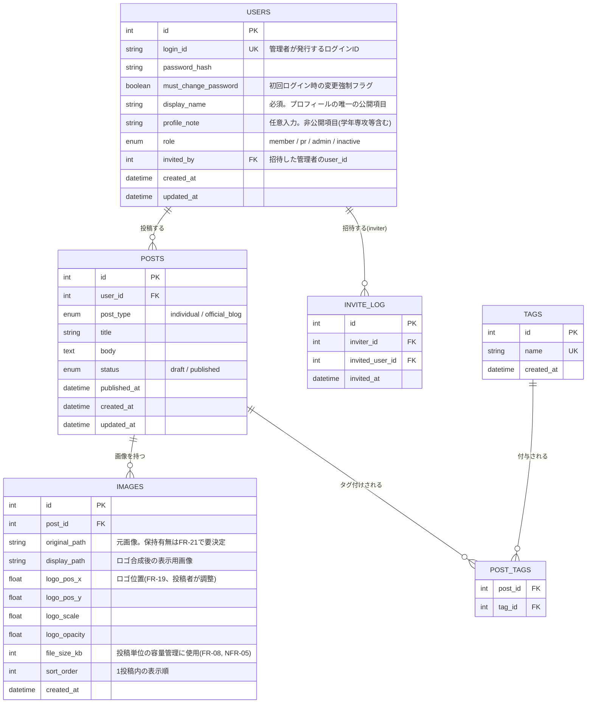

# 九産模型愛好会 公式サイト DB構造 草案（v0.1）

要件定義書v0.4の機能要件・非機能要件、およびsitemap.mdの画面遷移を踏まえたテーブル設計の草案です。詳細な型・制約は実装時にClaude Codeと調整する前提で、要件定義書の各FR/NFRに対応づけながら大枠を示します。

## ER図

## テーブル定義

### users（会員）
| カラム | 型 | 制約 | 説明 |
|---|---|---|---|
| id | INT | PK, AUTO_INCREMENT | |
| login_id | VARCHAR(64) | UNIQUE, NOT NULL | 管理者が招待時に発行するログインID（FR-01） |
| password_hash | VARCHAR(255) | NOT NULL | bcrypt等でハッシュ化（NFR-02） |
| must_change_password | BOOLEAN | NOT NULL, DEFAULT TRUE | 初回ログイン時の変更強制。要決定事項(11.2-2)に対応する仮設計 |
| display_name | VARCHAR(100) | NOT NULL | プロフィールの必須項目・唯一の公開項目（FR-03） |
| profile_note | TEXT | NULL可 | 学年・専攻等の任意入力項目。**サイト上では非公開**として扱う（FR-03） |
| role | ENUM('member','pr','admin','inactive') | NOT NULL, DEFAULT 'member' | 会員／広報担当／管理者／休止会員（FR-09） |
| invited_by | INT | FK → users.id, NULL可 | 招待した管理者。初代管理者はNULL |
| created_at | DATETIME | NOT NULL | |
| updated_at | DATETIME | NOT NULL | |

**設計メモ**：ロールは1ユーザー1ロールの単純なENUMとした。管理者権限の委譲（FR-10）は新規テーブルを設けず、`account_edit`画面からこの`role`カラムを書き換える操作として実現する想定（前回のやり取りで確認済みの方針）。休止会員（inactive）への遷移も同じ仕組みで行う。

### invite_log（招待履歴）
| カラム | 型 | 制約 | 説明 |
|---|---|---|---|
| id | INT | PK | |
| inviter_id | INT | FK → users.id | 招待した管理者 |
| invited_user_id | INT | FK → users.id | 発行されたアカウント |
| invited_at | DATETIME | NOT NULL | |

**設計メモ**：`users.invited_by`だけでも最低限は足りますが、管理者交代が複数回起きる運用（NFR-04で触れた引き継ぎのしやすさ）を考えると、誰が・いつ誰を招待したかの履歴を別テーブルで残しておくと、後任者が経緯を追いやすくなります。必須ではないので、実装コストが見合わなければ`users.invited_by`のみに簡略化しても構いません。

### posts（投稿）
| カラム | 型 | 制約 | 説明 |
|---|---|---|---|
| id | INT | PK | |
| user_id | INT | FK → users.id, NOT NULL | 投稿者 |
| post_type | ENUM('individual','official_blog') | NOT NULL | 個人作品／公式ブログ（FR-13） |
| title | VARCHAR(200) | NOT NULL | |
| body | TEXT | NOT NULL | |
| status | ENUM('draft','published') | NOT NULL, DEFAULT 'draft' | 承認待ちは設けない（FR-05, FR-07） |
| published_at | DATETIME | NULL可 | 公開操作時に記録 |
| created_at | DATETIME | NOT NULL | |
| updated_at | DATETIME | NOT NULL | |

**設計メモ**：`post_type = 'official_blog'`の投稿を作成できるのは`role = 'pr'`または`'admin'`のユーザーのみ、という制約はDB上のCHECK制約ではなくアプリケーション側のロジックで担保する想定です（FR-14）。休止会員（inactive）は`INSERT`不可・自分の既存投稿への`UPDATE`/`DELETE`のみ可、という制御も同様にアプリケーション層で行います。

### images（投稿画像）
| カラム | 型 | 制約 | 説明 |
|---|---|---|---|
| id | INT | PK | |
| post_id | INT | FK → posts.id, NOT NULL | 1投稿に複数画像を許容（作品ギャラリーとして複数アングルの写真を想定） |
| original_path | VARCHAR(255) | NULL可 | ロゴ合成前の元画像。保存要否はFR-21で未確定のため、列自体は用意しつつ運用で決定 |
| display_path | VARCHAR(255) | NOT NULL | ロゴ合成後、実際にサイトへ表示する画像 |
| logo_pos_x | FLOAT | NOT NULL | ロゴの位置（投稿者が調整、FR-19） |
| logo_pos_y | FLOAT | NOT NULL | |
| logo_scale | FLOAT | NOT NULL | ロゴのサイズ |
| logo_opacity | FLOAT | NOT NULL | ロゴの透過度 |
| file_size_kb | INT | NOT NULL | 投稿単位の容量上限判定に使用（FR-08, NFR-05） |
| sort_order | INT | NOT NULL, DEFAULT 0 | 同一投稿内での表示順 |
| created_at | DATETIME | NOT NULL | |

**設計メモ**：要件定義書は「画像＋タイトル＋本文＋タグ」とだけ記載しており単数・複数を明言していません。ギャラリーサイトの性質上、1作品につき複数枚の写真を載せたいケースが多いと想定し、1対多で設計しています。単一画像のみでよい場合は`posts`テーブルに直接カラムを持たせる形に簡略化できます。

### tags（タグ）
| カラム | 型 | 制約 | 説明 |
|---|---|---|---|
| id | INT | PK | |
| name | VARCHAR(50) | UNIQUE, NOT NULL | 表記ゆれは管理者が統合（FR-17） |
| created_at | DATETIME | NOT NULL | |

### post_tags（投稿とタグの中間テーブル）
| カラム | 型 | 制約 | 説明 |
|---|---|---|---|
| post_id | INT | FK → posts.id | 複合PK |
| tag_id | INT | FK → tags.id | 複合PK |

**設計メモ**：新規タグ入力と既存タグ選択の併用（FR-16）は、投稿フォーム側で「選択済みタグID」と「新規タグ文字列」を両方受け取り、新規文字列は`tags`にINSERT（既存なら流用）してから`post_tags`に紐づける、という処理で実現できます。

## 要件定義書との対応関係（未反映・要検討の点）

- FR-08（投稿単位の容量上限の具体的な数値）：`images.file_size_kb`の合計に対する上限値は未確定（11.2-1）。数値が決まり次第、アプリケーション側のバリデーション値として設定します。
- FR-21（元画像を保存するか）：`images.original_path`を列として用意していますが、運用しない場合はこの列とアップロード時の保存処理自体を省略できます（11.2-4）。
- FR-19（ロゴ調整フォームの具体的な操作項目）：`logo_pos_x/y`, `scale`, `opacity`の4値を最小構成として置いていますが、フォームの仕様（プレビューの有無等）が固まった時点で列の過不足を見直します（11.2-3）。
- 広報担当ロールの運用ルール（11.2-5）：DB構造には影響しない運用面の話のため、この設計では反映していません。

これはあくまで草案であり、実装に入る段階でClaude Codeと相談しながら型やインデックス、文字コード（UTF-8mb4推奨）等を詰めていく前提のたたき台です。
