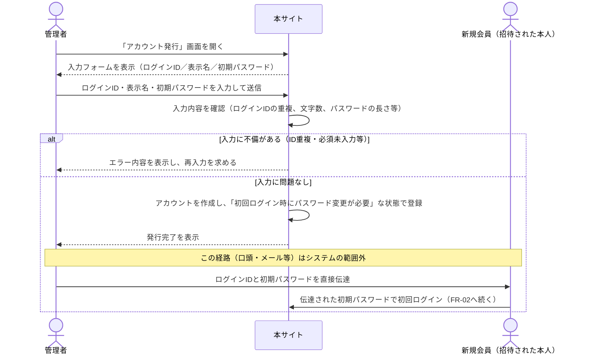
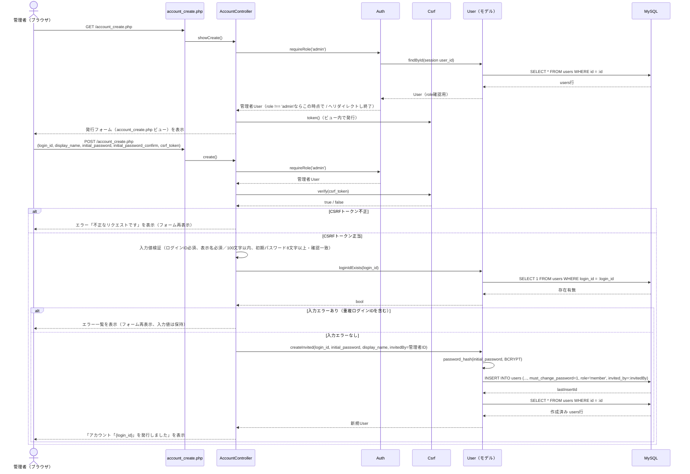
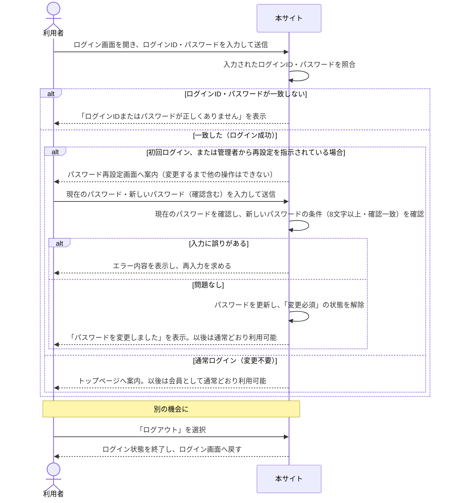
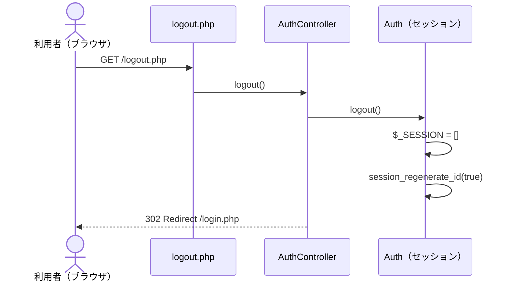
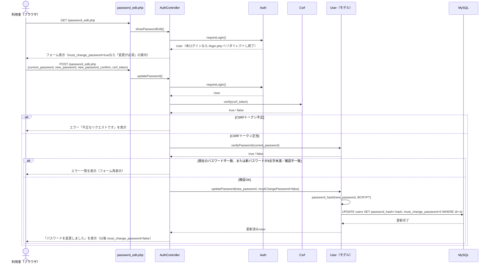

# シーケンス図（FR-01・FR-02）

実装コード（`public/*.php` → `src/Controllers/*.php` → `src/Core/*.php` / `src/Models/*.php`）に基づく処理フローを示す。

## FR-01：会員登録（業務フロー版・利用者/関係者向け）

CSRF検証やDBクエリ等の実装詳細を省き、「誰が」「何を」「どういう順番で」行うかという業務レベルの粒度で示す。実装レベルの詳細は次節（実装コード対応版）を参照。

補足：
- 会員登録は招待コードの自動発行・自動送信ではなく、**管理者が発行から本人への伝達まで一貫して行う**運用（招待制、要件定義書FR-01確定事項）。
- 初期パスワードの伝達手段（口頭・メール等）はシステムの機能としては実装されておらず、管理者の運用に委ねられる。
- 発行されたアカウントは自動的に「会員」ロールとなり、権限の昇格（広報担当・管理者）は別の操作（FR-10・FR-14）で行う。

## FR-01：会員登録（実装コード対応版）

対応コード：`public/account_create.php` → `AccountController::showCreate()` / `create()` → `User::createInvited()`

補足：
- 招待コード方式ではなく、管理者がログインIDと初期パスワードを直接指定して発行する方式（要件定義書 FR-01 確定事項）。
- 発行直後は `must_change_password = 1` が設定され、本人の初回ログイン時にパスワード変更が強制される（FR-02 と接続）。
- ロールは常に `member` 固定で発行される（広報担当・管理者への昇格は別途 FR-10／FR-14 で行う）。

## FR-02：ログイン／ログアウト／パスワード再設定（業務フロー版・利用者/関係者向け）

CSRF検証やDBクエリ等の実装詳細を省き、「誰が」「何を」「どういう順番で」行うかという業務レベルの粒度で示す。実装レベルの詳細は次節（実装コード対応版）を参照。

補足：
- 「初回ログイン」以外にも、後述のFR-11（休止会員化）等の運用でパスワード変更が必要な状態になり得るため、分岐は「初回ログインに限らない」形で示している。
- パスワード再設定はログイン中の利用者であれば任意のタイミングでも行える（強制されていない場合も同じ画面・同じ手順を使う）。
- 休止会員（退会・卒業済み）もログイン・パスワード再設定は可能（要件定義書のロール定義に基づく。新規投稿・プロフィール編集のみ不可）。

## FR-02：ログイン／ログアウト／パスワード再設定（実装コード対応版）

対応コード：`public/login.php` → `AuthController::login()`、`public/logout.php` → `AuthController::logout()`、`public/password_edit.php` → `AuthController::showPasswordEdit()` / `updatePassword()`

### 2-1. ログイン（初回強制パスワード変更への分岐を含む）

```mermaid
sequenceDiagram
    actor User as 利用者（ブラウザ）
    participant Entry as login.php
    participant Ctrl as AuthController
    participant Csrf as Csrf
    participant UserModel as User（モデル）
    participant DB as MySQL
    participant Auth as Auth（セッション）

    User->>Entry: GET /login.php
    Entry->>Ctrl: showLogin()
    Ctrl->>Auth: check()
    Auth-->>Ctrl: 未ログイン
    Ctrl-->>User: ログインフォームを表示

    User->>Entry: POST /login.php (login_id, password, csrf_token)
    Entry->>Ctrl: login()
    Ctrl->>Csrf: verify(csrf_token)
    Csrf-->>Ctrl: true / false

    alt CSRFトークン不正、またはログインID／パスワード未入力
        Ctrl-->>User: エラーメッセージを表示（フォーム再表示）
    else 入力あり・CSRF正当
        Ctrl->>UserModel: findByLoginId(login_id)
        UserModel->>DB: SELECT * FROM users WHERE login_id = :login_id
        DB-->>UserModel: users行 or 該当なし
        UserModel-->>Ctrl: User or null

        alt ユーザーが存在しない、またはパスワード不一致
            Ctrl->>UserModel: verifyPassword(password)
            UserModel-->>Ctrl: false
            Ctrl-->>User: 「ログインIDまたはパスワードが正しくありません」を表示
        else 認証成功
            Ctrl->>UserModel: verifyPassword(password)
            UserModel-->>Ctrl: true
            Ctrl->>Auth: login(user)
            Auth->>Auth: session_regenerate_id(true)
            Auth->>Auth: $_SESSION['user_id'] = user.id

            alt must_change_password = true（初回ログイン等）
                Ctrl-->>User: 302 Redirect /password_edit.php
            else must_change_password = false
                Ctrl-->>User: 302 Redirect /（トップページ）
            end
        end
    end
```

### 2-2. ログアウト

### 2-3. パスワード再設定（強制変更・任意変更共通）

