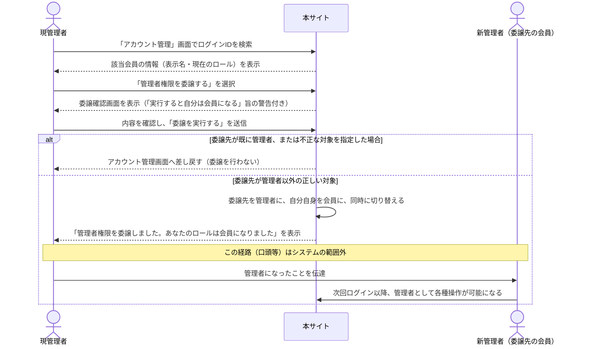
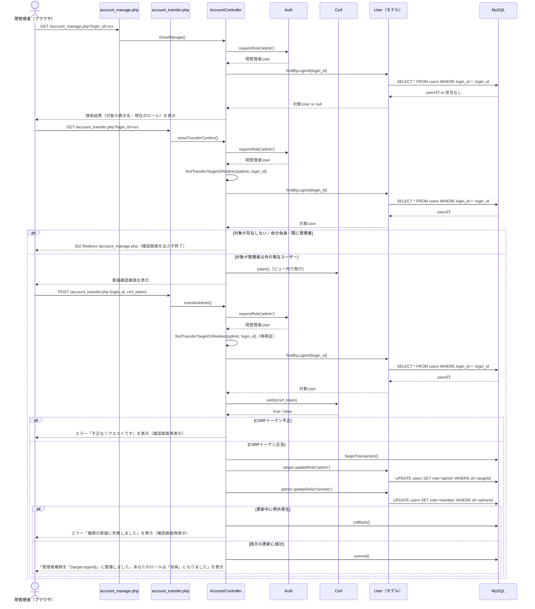

# シーケンス図（FR-10）

実装コード（`public/*.php` → `src/Controllers/*.php` → `src/Core/*.php` / `src/Models/*.php`）に基づく処理フローを示す。FR-01・FR-02の資料（`docs/sequence_fr01_fr02.md`）と同様に、「業務フロー版（利用者・関係者向け）」「実装コード対応版」の2段構成とする。

## FR-10：管理者権限の委譲（業務フロー版・利用者/関係者向け）

CSRF検証やDBクエリ等の実装詳細を省き、「誰が」「何を」「どういう順番で」行うかという業務レベルの粒度で示す。実装レベルの詳細は次節（実装コード対応版）を参照。

補足：
- 委譲は**新管理者への昇格と現管理者の降格が不可分の1操作**として実行される（片方だけが成功する状態を作らない）。
- 委譲操作を実行した本人はその場でロールが「会員」に変わるため、以後は元の管理者専用画面（アカウント発行・管理等）にアクセスできなくなる。
- 委譲は取り消し操作を持たない（元に戻すには、新管理者が改めて委譲を実行する必要がある）。

## FR-10：管理者権限の委譲（実装コード対応版）

対応コード：`public/account_manage.php` → `AccountController::showManage()`、`public/account_transfer.php` → `AccountController::showTransferConfirm()` / `transferAdmin()` → `User::updateRole()`

補足：
- `showTransferConfirm()`と`transferAdmin()`の両方で`findTransferTargetOrRedirect()`による対象検証を独立して行っている（確認画面表示時と実行時で対象の状態が変わっている可能性への対策）。
- 新管理者への昇格と現管理者の降格は`Database::connection()->beginTransaction()`〜`commit()`で1つのトランザクションにまとめられており、片方のみが反映される状態（例：新管理者は昇格したが旧管理者は降格していない）を防いでいる。
- `Auth::user()`はDBを毎回再取得する実装のため、`transferAdmin()`実行中に別タブ等で旧管理者のセッションを操作しても、次回アクセス時には即座に新しいロール（会員）が反映される。
