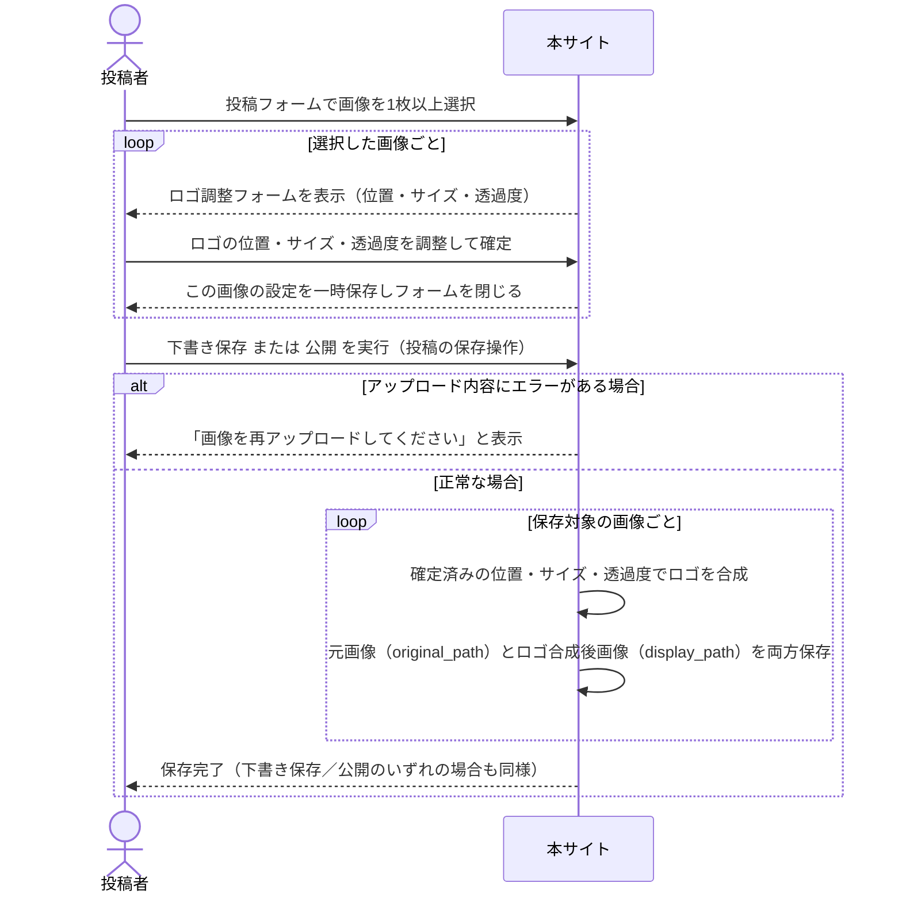

# シーケンス図（FR-19〜FR-21）設計ドラフト

ロゴ合成機能（FR-19：位置・サイズ・透過度の調整フォーム、FR-20：投稿保存時の同期処理、FR-21：元画像の保存要否）は未実装のため、実装コード対応版ではなく設計ドラフットとして扱う。以下の4点は前回の確認で決定済みの内容を反映している。

1. 元画像の保存要否（FR-21）：**DBの設計に従う**（`images.original_path`／`display_path`を別カラムで保持する現行スキーマの通り、元画像を上書きせず両方を保存する）
2. 調整フォームの操作項目（FR-19）：**要件定義書に従う**（位置・サイズ・透過度をすべて調整可能とする）
3. 合成処理のタイミング（FR-20）：**保存操作全体を指す**（公開時に限らず、下書き保存も含めた投稿の保存操作のタイミングで同期的に合成する）
4. 複数画像投稿時の扱い：**画像ごとに個別に調整する**（1投稿に複数画像がある場合、それぞれ独立してロゴの位置・サイズ・透過度を設定する）

## 補足

- 元画像は上書きせず、`images.original_path`にオリジナル、`display_path`にロゴ合成後の表示用画像をそれぞれ保存する。これにより後からロゴの再調整・元画像の再利用が可能になる（ディスク容量は投稿単位の上限（FR-08）で制御する）。
- ロゴ調整フォームでは位置・サイズ・透過度の3項目すべてを操作対象とする（DBスキーマの`logo_pos_x`/`logo_pos_y`/`logo_scale`/`logo_opacity`に対応）。
- 合成処理は下書き保存・公開のどちらの保存操作でも同期的に実行する（非同期キューは設けない、FR-20確定事項）。下書きの時点でもロゴ合成済みの表示用画像が生成される。
- 複数画像がある投稿では、画像ごとに個別のロゴ調整・個別の合成処理を行う（全画像共通の一括設定にはしない）。
- プレビュー表示の要否・具体的な操作UI（ドラッグ操作かスライダー入力か等）は本ドラフトの範囲外であり、別途フォーム実装時に検討する。
