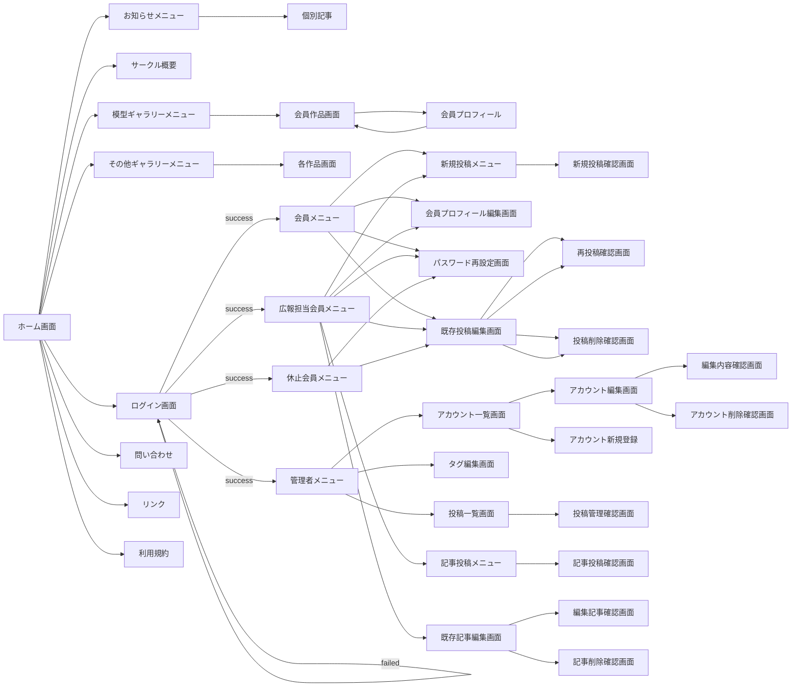

```mermaid
flowchart LR
  home[ホーム画面]
  login[ログイン画面]

  home --> login

  %% サイドメニュー遷移
  home --> club_description[サークル概要]
  home --> information_menu[お知らせメニュー]
  home --> model_gallery_menu[模型ギャラリーメニュー]
  home --> other_gallery_menu[その他ギャラリーメニュー]
  home --> contact[問い合わせ]
  home --> link[リンク]
  home --> tos[利用規約]

  %% お知らせ遷移
  information_menu --> information_page[個別記事]

  %% 模型ギャラリー遷移
  model_gallery_menu --> md_gallery_page[会員作品画面] --> member_profile[会員プロフィール] --> md_gallery_page

  %% その他ギャラリー遷移
  other_gallery_menu --> ot_gallery_page[各作品画面]

  %% ログイン時遷移
  login --success--> members_menu[会員メニュー]
  login --success--> admin_menu[管理者メニュー]
  login --success--> PR_menu[広報担当会員メニュー]
  login --success--> OB_menu[休止会員メニュー]
  login --failed--> login

  %% 会員メニュー遷移
  members_menu --> new_post_menu[新規投稿メニュー] --> new_post_confirm[新規投稿確認画面]
  members_menu --> profile_edit[会員プロフィール編集画面]
  members_menu --> password_edit[パスワード再設定画面]
  members_menu --> post_edit_menu[既存投稿編集画面] --> edited_post_confirm[再投稿確認画面]
  post_edit_menu --> post_delete_confirm[投稿削除確認画面]

  %% 管理者メニュー遷移
  admin_menu --> account_manager[アカウント一覧画面] --> account_edit[アカウント編集画面] --> edited_account_confirm[編集内容確認画面]
  account_edit --> account_delete_confirm[アカウント削除確認画面]
  account_manager --> new_account_create[アカウント新規登録]
  admin_menu --> tag_manager[タグ編集画面]
  admin_menu --> post_manager[投稿一覧画面] --> post_manage_confirm[投稿管理確認画面]

  %% 広報担当会員メニュー遷移
  PR_menu --> information_post_menu[記事投稿メニュー] --> information_post_confirm[記事投稿確認画面]
  PR_menu --> information_post_edit[既存記事編集画面] --> edited_i_post_confirm[編集記事確認画面]
  information_post_edit --> i_post_delete_confirm[記事削除確認画面]
  PR_menu --> new_post_menu
  PR_menu --> profile_edit
  PR_menu --> password_edit
  PR_menu --> post_edit_menu

  %% 休止会員メニュー遷移
  OB_menu --> password_edit
  OB_menu --> post_edit_menu --> edited_post_confirm
  post_edit_menu --> post_delete_confirm


```